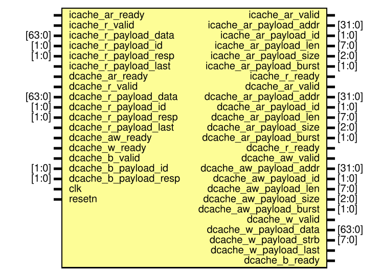

# Entity: DandMaxFreq 
- **File**: DandMaxFreq.v

## Diagram


## Overview

`DandMaxFreq` is a 64-bit RISC-V core top generated from the
`dandriscv.super_scalar_1issue` SpinalHDL sources. It has a 32-bit program
counter, a 64-bit integer datapath, separated instruction/data memory
interfaces, a cached instruction path, and an uncached data-side AXI bridge.

The core is in-order and single-issue in this top-level configuration. Fetch
can queue PC/instruction metadata, but `Control` accepts one instruction,
dispatches it to one execution unit, waits for the selected result to write
back to the architectural register file, and then accepts the next instruction.

Key characteristics:

| Item | Value |
| ---- | ----- |
| XLEN | 64 |
| PC width | 32 |
| Memory address width | 32 |
| Reset vector | `0x80000000` |
| I-cache | 16 KB, 2-way, 64-byte line |
| I-cache CPU/bus width | 32-bit instruction return, 64-bit external read data |
| Data memory path | `BIUTop`, uncached AXI read/write bridge |
| Branch prediction | Static JAL/backward-branch predictor |
| Timer | Local `mtime`/`mtimecmp`, memory mapped through LSU |
| Reset | Active-low `resetn` |

## Micro Architecture

The top-level datapath is:

```text
FetchStage -> ICacheTop -> static_predictor
     |
     v
Control: Decode + ARF + dispatch/writeback control
     |
     +--> ALU -> writeback
     +--> BJU -> redirect/interrupt + writeback
     +--> LSU -> BIUTop/Timer -> writeback
```

### Fetch and Prediction

`FetchStage` wraps the `Fetch` module. The PC register resets to
`0x80000000`. Fetch issues instruction commands to `ICacheTop`, records PC,
next-PC, prediction-taken, and instruction data in small FIFOs, and emits a
single stream into `Control`.

Fetch updates the PC with this priority:

1. BJU interrupt/exception target.
2. BJU redirect target after branch/jump correction.
3. Static predictor target.
4. Sequential `pc + 4` after an I-cache command fires.

The instantiated `static_predictor` predicts:

- `JAL`: taken to `pc + imm`.
- Conditional branch: taken only for a negative immediate, which implements a
  backward-taken/forward-not-taken policy.
- Other instructions: not taken.

The generated RTL also contains training outputs from `BJU`, and the source
tree contains a `gshare_predictor`, but this top instantiates the static
predictor and does not connect training signals back to it.

### Instruction Cache

`ICacheTop` instantiates `ICache` and SRAM banks. It is a 16 KB, 2-way
set-associative cache with 64-byte lines and valid/tag/MRU replacement
metadata. On a hit, it reads the selected SRAM bank and returns a 32-bit
instruction. On a miss, it refills the whole line from the external instruction
read channel and then returns the requested word.

The configuration sets `noBurst=true`, so the AXI read adapter emits repeated
single-beat requests for a line refill. `icache_ar_payload_len` is driven as
`0`, `icache_ar_payload_size` is `3` for 64-bit beats, the address increments
by 8 bytes per beat, and instruction reads use AXI ID `0`.

### Control, Decode, and Register File

`Control` contains `Decode`, `ARF`, dispatch streams, and writeback selection.
It maintains a `ready` register. When an instruction fires from fetch, `Control`
dispatches it to exactly one of the execution units and holds `ready` low until
the selected unit produces writeback.

`Decode` classifies instructions into:

| Class | Destination unit | Examples |
| ----- | ---------------- | -------- |
| `RobMicroOp_ALU` | `ALU` | integer ALU, immediate ALU, LUI, word ops, multiply/divide/remainder |
| `RobMicroOp_BJU` | `BJU` | AUIPC, JAL, JALR, branches, system/CSR |
| `RobMicroOp_LSU` | `LSU` | loads and stores |
| `RobMicroOp_IDLE` | none | unsupported or unrecognized instruction class |

`ARF` is the architectural register file. It has two combinational read ports
and one write port. Writes to `x0` are suppressed, and same-cycle writeback data
is forwarded to reads of the same register.

### ALU

`ALU` implements the integer execute path:

- Add/subtract: `ADD`, `ADDI`, `SUB`, `ADDW`, `ADDIW`, `SUBW`.
- Compare: `SLT`, `SLTI`, `SLTU`, `SLTIU`.
- Logic: `XOR`, `XORI`, `AND`, `ANDI`, `OR`, `ORI`.
- Shift: `SLL`, `SLLI`, `SRL`, `SRLI`, `SRA`, `SRAI`, and word forms.
- Upper immediate: `LUI`.
- Multiply: `MUL`, `MULH`, `MULHSU`, `MULHU`, `MULW`.
- Divide/remainder: `DIV`, `DIVU`, `REM`, `REMU`, `DIVW`, `DIVUW`, `REMW`, `REMUW`.

Multiply is calculated in the ALU datapath. Divide and remainder use the
`Divider` submodule; while the divider is busy, the ALU input stream is held
until `done_valid`.

### Branch, Jump, CSR, and Interrupt Unit

`BJU` wraps `BJU_kernel`, `CsrRegfile`, and `Clint`.

Branch/jump functions:

- Resolves `BEQ`, `BNE`, `BLT`, `BGE`, `BLTU`, and `BGEU`.
- Computes `JAL` target as `pc + imm`.
- Computes `JALR` target as `(rs1 + imm) & ~1`.
- Generates link results for jump instructions and `pc + imm` style results
  for `AUIPC`.
- Compares the resolved outcome/target with fetch prediction and raises
  `redirect_valid` plus `redirect_pc` on misprediction or wrong target.

CSR and trap functions:

- Implements `ECALL`, `EBREAK`, and `MRET`.
- Implements `CSRRW`, `CSRRS`, `CSRRC`, `CSRRWI`, `CSRRSI`, and `CSRRCI`.
- Maintains machine CSRs including `mstatus`, `mie`, `mtvec`, `mepc`,
  `mcause`, `mtval`, `mip`, `mcycle`, `mhartid`, and `mscratch`.
- Handles timer interrupt when global interrupt enable, machine timer interrupt
  enable, and timer pending are all active.
- Redirects exceptions and timer interrupts to `mtvec`; redirects `MRET` to
  `mepc`.

At the top level, `change_flow = bju_1_interrupt_valid ||
bju_1_redirect_valid`. This signal flushes fetch/control and causes fetch to
load the corrected PC.

### LSU, Timer, and Data Memory

`LSU` computes effective address as `rs1 + imm` and supports:

- Loads: `LB`, `LBU`, `LH`, `LHU`, `LW`, `LWU`, `LD`.
- Stores: `SB`, `SH`, `SW`, `SD`.

Load data is shifted by the byte offset and sign- or zero-extended according to
the load type. Store data and byte strobes are shifted according to the address
offset. AXI size values are `0` for byte, `1` for halfword, `2` for word, and
`3` for doubleword.

The LSU detects the local timer addresses `MTIME` and `MTIMECMP` and drives
`Timer` control signals for those accesses. In the generated top-level wiring,
`timer_1_rdata` is produced by `Timer` but is not connected back into the LSU
writeback path, so the visible top-level timer path should be treated as the
interrupt/source-register side of the design rather than a complete timer-load
datapath. `Timer` increments `mtime` every cycle when it is not being written,
compares `mtime >= mtimecmp`, and raises `timer_int`.

Although the source tree includes a set-associative `DCacheTop`, this generated
top instantiates `BIUTop`. Therefore the top-level data path is uncached:

- Reads emit a single-beat AR request with AXI ID `1`.
- Writes emit single-beat AW/W requests with AXI ID `2`.
- `dcache_r_ready` and `dcache_b_ready` are driven ready by the bridge.
- Store completion is reported after the write response.

## ISA and Function Coverage

The visible decode implements an RV64 integer core with the M extension and a
machine-mode CSR/trap subset:

- RV64 integer arithmetic, logic, shifts, compares, LUI, and AUIPC.
- RV64 word operations.
- Loads and stores for byte, halfword, word, unsigned word, and doubleword.
- Conditional branches, `JAL`, and `JALR`.
- Multiply, high multiply, divide, and remainder operations.
- Machine CSR operations, `ECALL`, `EBREAK`, `MRET`, and timer interrupt entry.

Not implemented by this decode path:

- Compressed instructions.
- Atomic instructions.
- Floating-point instructions.
- Vector instructions.
- Full privilege and virtual-memory machinery beyond the listed machine CSRs.

## Top-Level Port Groups

| Port group | Direction from core | Description |
| ---------- | ------------------- | ----------- |
| `icache_ar_*` | output | Instruction AXI read address channel. |
| `icache_r_*` | input/output ready | Instruction AXI read response channel. |
| `dcache_ar_*` | output | Data AXI read address channel. |
| `dcache_r_*` | input/output ready | Data AXI read response channel. |
| `dcache_aw_*` | output | Data AXI write address channel. |
| `dcache_w_*` | output/input ready | Data AXI write data channel. |
| `dcache_b_*` | input/output ready | Data AXI write response channel. |
| `clk` | input | Core clock. |
| `resetn` | input | Active-low reset. |

## Important Internal Modules

| Instance | Module | Function |
| -------- | ------ | -------- |
| `fetch_1` | `FetchStage` | PC generation, fetch FIFO alignment, prediction metadata. |
| `icache_1` | `ICacheTop` | Instruction cache and AXI read conversion. |
| `bpu` | `static_predictor` | Static branch/jump prediction. |
| `control_1` | `Control` | Decode, ARF access, dispatch, writeback. |
| `bju_1` | `BJU` | Branch/jump resolution, CSR, exceptions, timer interrupt handling. |
| `alu_1` | `ALU` | Integer ALU, multiply, divide, remainder. |
| `lsu_1` | `LSU` | Address generation, load/store formatting, timer decode. |
| `dcache` | `BIUTop` | Uncached data AXI bridge. |
| `timer_1` | `Timer` | `mtime`/`mtimecmp` and timer interrupt. |

## Notes

- Several internal fields keep ROB/IQ-style names. In this top, `rd_rob_ptr` is
  effectively tied to zero and there is no active reorder buffer.
- Generated enum string signals in `DandMaxFreq.v` are simulation/debug aids and
  are not required for functional behavior.
- `dcache_config` exists in the source, but the generated `DandMaxFreq` top uses
  `BIUTop`, not the cached `DCacheTop`.

## Ports

| Port name               | Direction | Type   | Description |
| ----------------------- | --------- | ------ | ----------- |
| icache_ar_valid         | output    |        | Instruction read address request valid. |
| icache_ar_ready         | input     |        | External instruction bus accepts AR request. |
| icache_ar_payload_addr  | output    | [31:0] | Instruction read address. |
| icache_ar_payload_id    | output    | [1:0]  | Instruction read transaction ID, driven as ID 0. |
| icache_ar_payload_len   | output    | [7:0]  | AXI burst length. In `noBurst` mode this is 0 per beat. |
| icache_ar_payload_size  | output    | [2:0]  | AXI transfer size. Driven as 3 for 64-bit instruction-bus beats. |
| icache_ar_payload_burst | output    | [1:0]  | AXI burst type. Driven as INCR. |
| icache_r_valid          | input     |        | Instruction read response valid. |
| icache_r_ready          | output    |        | Core accepts instruction read data. |
| icache_r_payload_data   | input     | [63:0] | Instruction read response data. |
| icache_r_payload_id     | input     | [1:0]  | Instruction read response ID; ID 0 is consumed by `ICacheTop`. |
| icache_r_payload_resp   | input     | [1:0]  | AXI read response status. |
| icache_r_payload_last   | input     |        | AXI read last beat indicator. |
| dcache_ar_valid         | output    |        | Data read address request valid. |
| dcache_ar_ready         | input     |        | External data bus accepts AR request. |
| dcache_ar_payload_addr  | output    | [31:0] | Data read address. |
| dcache_ar_payload_id    | output    | [1:0]  | Data read transaction ID, driven as ID 1 by `BIUTop`. |
| dcache_ar_payload_len   | output    | [7:0]  | Data read burst length. Driven as 0 for single-beat reads. |
| dcache_ar_payload_size  | output    | [2:0]  | Data read transfer size from LSU access width. |
| dcache_ar_payload_burst | output    | [1:0]  | AXI burst type. Driven as INCR. |
| dcache_r_valid          | input     |        | Data read response valid. |
| dcache_r_ready          | output    |        | Core accepts data read response. |
| dcache_r_payload_data   | input     | [63:0] | Data read response data. |
| dcache_r_payload_id     | input     | [1:0]  | Data read response ID; ID 1 is used for LSU reads. |
| dcache_r_payload_resp   | input     | [1:0]  | AXI read response status. |
| dcache_r_payload_last   | input     |        | AXI read last beat indicator. |
| dcache_aw_valid         | output    |        | Data write address request valid. |
| dcache_aw_ready         | input     |        | External data bus accepts AW request. |
| dcache_aw_payload_addr  | output    | [31:0] | Data write address. |
| dcache_aw_payload_id    | output    | [1:0]  | Data write transaction ID, driven as ID 2 by `BIUTop`. |
| dcache_aw_payload_len   | output    | [7:0]  | Data write burst length. Driven as 0 for single-beat writes. |
| dcache_aw_payload_size  | output    | [2:0]  | Data write transfer size from LSU access width. |
| dcache_aw_payload_burst | output    | [1:0]  | AXI burst type. Driven as INCR. |
| dcache_w_valid          | output    |        | Data write payload valid. |
| dcache_w_ready          | input     |        | External data bus accepts W payload. |
| dcache_w_payload_data   | output    | [63:0] | Data write payload, shifted to the byte offset. |
| dcache_w_payload_strb   | output    | [7:0]  | Byte write strobes from LSU access width and address offset. |
| dcache_w_payload_last   | output    |        | Write last beat indicator, asserted for single-beat writes. |
| dcache_b_valid          | input     |        | Data write response valid. |
| dcache_b_ready          | output    |        | Core accepts write response. |
| dcache_b_payload_id     | input     | [1:0]  | Data write response ID; ID 2 corresponds to LSU writes. |
| dcache_b_payload_resp   | input     | [1:0]  | AXI write response status. |
| clk                     | input     |        | Core clock. |
| resetn                  | input     |        | Active-low reset. |

## Signals

The following table is the raw top-level generated signal list. The functional
role of these signals is described in the micro-architecture sections above;
names follow the pattern `<instance>_<interface>_<field>`.

| Name                                                    | Type        | Description |
| ------------------------------------------------------- | ----------- | ----------- |
| bpu_predict_imm                                         | wire [31:0] |             |
| fetch_1_icache_ports_cmd_valid                          | wire        |             |
| fetch_1_icache_ports_cmd_payload_addr                   | wire [31:0] |             |
| fetch_1_bpu_predict_pc                                  | wire [31:0] |             |
| fetch_1_bpu_predict_valid                               | wire        |             |
| fetch_1_dst_ports_valid                                 | wire        |             |
| fetch_1_dst_ports_payload_pc                            | wire [31:0] |             |
| fetch_1_dst_ports_payload_pc_next                       | wire [31:0] |             |
| fetch_1_dst_ports_payload_bpu_pred_taken                | wire        |             |
| fetch_1_dst_ports_payload_instruction                   | wire [31:0] |             |
| fetch_1_bpu_predict_imm                                 | wire [63:0] |             |
| fetch_1_bpu_predict_jal                                 | wire        |             |
| fetch_1_bpu_predict_branch                              | wire        |             |
| icache_1_icache_ports_cmd_ready                         | wire        |             |
| icache_1_icache_ports_rsp_valid                         | wire        |             |
| icache_1_icache_ports_rsp_payload_data                  | wire [31:0] |             |
| icache_1_icache_ar_valid                                | wire        |             |
| icache_1_icache_ar_payload_addr                         | wire [31:0] |             |
| icache_1_icache_ar_payload_id                           | wire [1:0]  |             |
| icache_1_icache_ar_payload_len                          | wire [7:0]  |             |
| icache_1_icache_ar_payload_size                         | wire [2:0]  |             |
| icache_1_icache_ar_payload_burst                        | wire [1:0]  |             |
| icache_1_icache_r_ready                                 | wire        |             |
| bpu_predict_taken                                       | wire        |             |
| bpu_target_pc                                           | wire [31:0] |             |
| control_1_src_ports_ready                               | wire        |             |
| control_1_to_ports_alu_valid                            | wire        |             |
| control_1_to_ports_alu_payload_rd_rob_ptr               | wire [3:0]  |             |
| control_1_to_ports_alu_payload_micro_op_rd_wen          | wire        |             |
| control_1_to_ports_alu_payload_micro_op_src2_is_imm     | wire        |             |
| control_1_to_ports_alu_payload_micro_op_alu_ctrl_op     | wire [4:0]  |             |
| control_1_to_ports_alu_payload_micro_op_alu_is_word     | wire        |             |
| control_1_to_ports_alu_payload_src1_data                | wire [63:0] |             |
| control_1_to_ports_alu_payload_src2_data                | wire [63:0] |             |
| control_1_to_ports_alu_payload_pc                       | wire [31:0] |             |
| control_1_to_ports_alu_payload_instruction              | wire [31:0] |             |
| control_1_to_ports_bju_valid                            | wire        |             |
| control_1_to_ports_bju_payload_rd_rob_ptr               | wire [3:0]  |             |
| control_1_to_ports_bju_payload_micro_op_rd_wen          | wire        |             |
| control_1_to_ports_bju_payload_micro_op_src2_is_imm     | wire        |             |
| control_1_to_ports_bju_payload_micro_op_bju_ctrl_op     | wire [3:0]  |             |
| control_1_to_ports_bju_payload_micro_op_bju_rd_eq_rs1   | wire        |             |
| control_1_to_ports_bju_payload_micro_op_bju_rd_is_link  | wire        |             |
| control_1_to_ports_bju_payload_micro_op_bju_rs1_is_link | wire        |             |
| control_1_to_ports_bju_payload_micro_op_exp_ctrl_op     | wire [3:0]  |             |
| control_1_to_ports_bju_payload_micro_op_exp_csr_addr    | wire [11:0] |             |
| control_1_to_ports_bju_payload_micro_op_exp_csr_wen     | wire        |             |
| control_1_to_ports_bju_payload_src1_data                | wire [63:0] |             |
| control_1_to_ports_bju_payload_src2_data                | wire [63:0] |             |
| control_1_to_ports_bju_payload_imm                      | wire [63:0] |             |
| control_1_to_ports_bju_payload_pc                       | wire [31:0] |             |
| control_1_to_ports_bju_payload_pc_next                  | wire [31:0] |             |
| control_1_to_ports_bju_payload_bpu_pred_taken           | wire        |             |
| control_1_to_ports_bju_payload_instruction              | wire [31:0] |             |
| control_1_to_ports_lsu_valid                            | wire        |             |
| control_1_to_ports_lsu_payload_rd_rob_ptr               | wire [3:0]  |             |
| control_1_to_ports_lsu_payload_micro_op_rd_wen          | wire        |             |
| control_1_to_ports_lsu_payload_micro_op_src2_is_imm     | wire        |             |
| control_1_to_ports_lsu_payload_micro_op_lsu_ctrl_op     | wire [3:0]  |             |
| control_1_to_ports_lsu_payload_micro_op_lsu_is_load     | wire        |             |
| control_1_to_ports_lsu_payload_micro_op_lsu_is_store    | wire        |             |
| control_1_to_ports_lsu_payload_src1_data                | wire [63:0] |             |
| control_1_to_ports_lsu_payload_src2_data                | wire [63:0] |             |
| control_1_to_ports_lsu_payload_imm                      | wire [63:0] |             |
| control_1_to_ports_lsu_payload_pc                       | wire [31:0] |             |
| control_1_to_ports_lsu_payload_instruction              | wire [31:0] |             |
| control_1_wb_ports_alu_ready                            | wire        |             |
| control_1_wb_ports_bju_ready                            | wire        |             |
| control_1_wb_ports_lsu_ready                            | wire        |             |
| bju_1_src_ports_ready                                   | wire        |             |
| bju_1_dst_ports_valid                                   | wire        |             |
| bju_1_dst_ports_payload_result                          | wire [63:0] |             |
| bju_1_dst_ports_payload_rd_wen                          | wire        |             |
| bju_1_dst_ports_payload_rd_rob_ptr                      | wire [3:0]  |             |
| bju_1_dst_ports_payload_pc                              | wire [31:0] |             |
| bju_1_dst_ports_payload_instruction                     | wire [31:0] |             |
| bju_1_redirect_valid                                    | wire        |             |
| bju_1_redirect_pc                                       | wire [31:0] |             |
| bju_1_train_valid                                       | wire        |             |
| bju_1_train_pc                                          | wire [31:0] |             |
| bju_1_train_taken                                       | wire        |             |
| bju_1_train_mispred                                     | wire        |             |
| bju_1_train_history                                     | wire [4:0]  |             |
| bju_1_train_pc_next                                     | wire [31:0] |             |
| bju_1_train_is_call                                     | wire        |             |
| bju_1_train_is_ret                                      | wire        |             |
| bju_1_train_is_jmp                                      | wire        |             |
| bju_1_interrupt_valid                                   | wire        |             |
| bju_1_interrupt_pc                                      | wire [31:0] |             |
| alu_1_src_ports_ready                                   | wire        |             |
| alu_1_dst_ports_valid                                   | wire        |             |
| alu_1_dst_ports_payload_result                          | wire [63:0] |             |
| alu_1_dst_ports_payload_rd_wen                          | wire        |             |
| alu_1_dst_ports_payload_rd_rob_ptr                      | wire [3:0]  |             |
| alu_1_dst_ports_payload_pc                              | wire [31:0] |             |
| alu_1_dst_ports_payload_instruction                     | wire [31:0] |             |
| lsu_1_src_ports_ready                                   | wire        |             |
| lsu_1_dst_ports_valid                                   | wire        |             |
| lsu_1_dst_ports_payload_result                          | wire [63:0] |             |
| lsu_1_dst_ports_payload_rd_wen                          | wire        |             |
| lsu_1_dst_ports_payload_rd_rob_ptr                      | wire [3:0]  |             |
| lsu_1_dst_ports_payload_pc                              | wire [31:0] |             |
| lsu_1_dst_ports_payload_instruction                     | wire [31:0] |             |
| lsu_1_dcache_ports_cmd_valid                            | wire        |             |
| lsu_1_dcache_ports_cmd_payload_addr                     | wire [31:0] |             |
| lsu_1_dcache_ports_cmd_payload_wen                      | wire        |             |
| lsu_1_dcache_ports_cmd_payload_wdata                    | wire [63:0] |             |
| lsu_1_dcache_ports_cmd_payload_wstrb                    | wire [7:0]  |             |
| lsu_1_dcache_ports_cmd_payload_size                     | wire [2:0]  |             |
| lsu_1_timer_cen                                         | wire        |             |
| lsu_1_timer_wen                                         | wire        |             |
| lsu_1_timer_addr                                        | wire [31:0] |             |
| lsu_1_timer_wdata                                       | wire [63:0] |             |
| dcache_stall                                            | wire        |             |
| dcache_dcache_ports_cmd_ready                           | wire        |             |
| dcache_dcache_ports_rsp_valid                           | wire        |             |
| dcache_dcache_ports_rsp_payload_data                    | wire [63:0] |             |
| dcache_dcache_ar_valid                                  | wire        |             |
| dcache_dcache_ar_payload_addr                           | wire [31:0] |             |
| dcache_dcache_ar_payload_id                             | wire [1:0]  |             |
| dcache_dcache_ar_payload_len                            | wire [7:0]  |             |
| dcache_dcache_ar_payload_size                           | wire [2:0]  |             |
| dcache_dcache_ar_payload_burst                          | wire [1:0]  |             |
| dcache_dcache_r_ready                                   | wire        |             |
| dcache_dcache_aw_valid                                  | wire        |             |
| dcache_dcache_aw_payload_addr                           | wire [31:0] |             |
| dcache_dcache_aw_payload_id                             | wire [1:0]  |             |
| dcache_dcache_aw_payload_len                            | wire [7:0]  |             |
| dcache_dcache_aw_payload_size                           | wire [2:0]  |             |
| dcache_dcache_aw_payload_burst                          | wire [1:0]  |             |
| dcache_dcache_w_valid                                   | wire        |             |
| dcache_dcache_w_payload_data                            | wire [63:0] |             |
| dcache_dcache_w_payload_strb                            | wire [7:0]  |             |
| dcache_dcache_w_payload_last                            | wire        |             |
| dcache_dcache_b_ready                                   | wire        |             |
| timer_1_rdata                                           | wire [63:0] |             |
| timer_1_timer_int                                       | wire        |             |
| change_flow                                             | wire        |             |

## Constants

The constants below are generated encodings for decoded micro-ops. They are
grouped by execution unit: ALU operations, BJU/control-transfer operations,
exception/CSR operations, and LSU load/store operations.

| Name               | Type | Value | Description |
| ------------------ | ---- | ----- | ----------- |
| AluCtrlEnum_IDLE   |      | 5'd0  |             |
| AluCtrlEnum_ADD    |      | 5'd1  |             |
| AluCtrlEnum_SUB    |      | 5'd2  |             |
| AluCtrlEnum_SLT    |      | 5'd3  |             |
| AluCtrlEnum_SLTU   |      | 5'd4  |             |
| AluCtrlEnum_XOR_1  |      | 5'd5  |             |
| AluCtrlEnum_SLL_1  |      | 5'd6  |             |
| AluCtrlEnum_SRL_1  |      | 5'd7  |             |
| AluCtrlEnum_SRA_1  |      | 5'd8  |             |
| AluCtrlEnum_AND_1  |      | 5'd9  |             |
| AluCtrlEnum_OR_1   |      | 5'd10 |             |
| AluCtrlEnum_LUI    |      | 5'd11 |             |
| AluCtrlEnum_MUL    |      | 5'd12 |             |
| AluCtrlEnum_MULH   |      | 5'd13 |             |
| AluCtrlEnum_MULHSU |      | 5'd14 |             |
| AluCtrlEnum_MULHU  |      | 5'd15 |             |
| AluCtrlEnum_DIV    |      | 5'd16 |             |
| AluCtrlEnum_DIVU   |      | 5'd17 |             |
| AluCtrlEnum_REM_1  |      | 5'd18 |             |
| AluCtrlEnum_REMU   |      | 5'd19 |             |
| AluCtrlEnum_MULW   |      | 5'd20 |             |
| AluCtrlEnum_DIVW   |      | 5'd21 |             |
| AluCtrlEnum_DIVUW  |      | 5'd22 |             |
| AluCtrlEnum_REMW   |      | 5'd23 |             |
| AluCtrlEnum_REMUW  |      | 5'd24 |             |
| BjuCtrlEnum_IDLE   |      | 4'd0  |             |
| BjuCtrlEnum_AUIPC  |      | 4'd1  |             |
| BjuCtrlEnum_JAL    |      | 4'd2  |             |
| BjuCtrlEnum_JALR   |      | 4'd3  |             |
| BjuCtrlEnum_BEQ    |      | 4'd4  |             |
| BjuCtrlEnum_BNE    |      | 4'd5  |             |
| BjuCtrlEnum_BLT    |      | 4'd6  |             |
| BjuCtrlEnum_BGE    |      | 4'd7  |             |
| BjuCtrlEnum_BLTU   |      | 4'd8  |             |
| BjuCtrlEnum_BGEU   |      | 4'd9  |             |
| BjuCtrlEnum_CSR    |      | 4'd10 |             |
| ExpCtrlEnum_IDLE   |      | 4'd0  |             |
| ExpCtrlEnum_ECALL  |      | 4'd1  |             |
| ExpCtrlEnum_EBREAK |      | 4'd2  |             |
| ExpCtrlEnum_MRET   |      | 4'd3  |             |
| ExpCtrlEnum_CSRRW  |      | 4'd4  |             |
| ExpCtrlEnum_CSRRS  |      | 4'd5  |             |
| ExpCtrlEnum_CSRRC  |      | 4'd6  |             |
| ExpCtrlEnum_CSRRWI |      | 4'd7  |             |
| ExpCtrlEnum_CSRRSI |      | 4'd8  |             |
| ExpCtrlEnum_CSRRCI |      | 4'd9  |             |
| LsuCtrlEnum_IDLE   |      | 4'd0  |             |
| LsuCtrlEnum_LB     |      | 4'd1  |             |
| LsuCtrlEnum_LBU    |      | 4'd2  |             |
| LsuCtrlEnum_LH     |      | 4'd3  |             |
| LsuCtrlEnum_LHU    |      | 4'd4  |             |
| LsuCtrlEnum_LW     |      | 4'd5  |             |
| LsuCtrlEnum_LWU    |      | 4'd6  |             |
| LsuCtrlEnum_LD     |      | 4'd7  |             |
| LsuCtrlEnum_SB     |      | 4'd8  |             |
| LsuCtrlEnum_SH     |      | 4'd9  |             |
| LsuCtrlEnum_SW     |      | 4'd10 |             |
| LsuCtrlEnum_SD     |      | 4'd11 |             |

## Instantiations

- fetch_1: FetchStage
- icache_1: ICacheTop
- bpu: static_predictor
- control_1: Control
- bju_1: BJU
- alu_1: ALU
- lsu_1: LSU
- dcache: BIUTop
- timer_1: Timer
